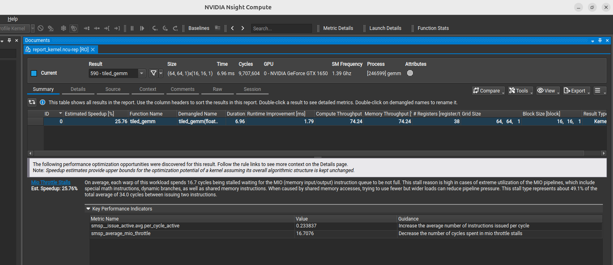
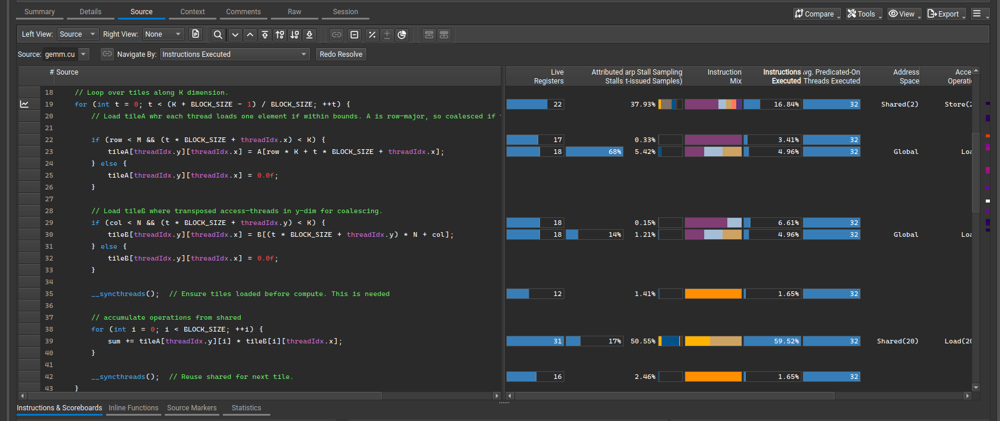
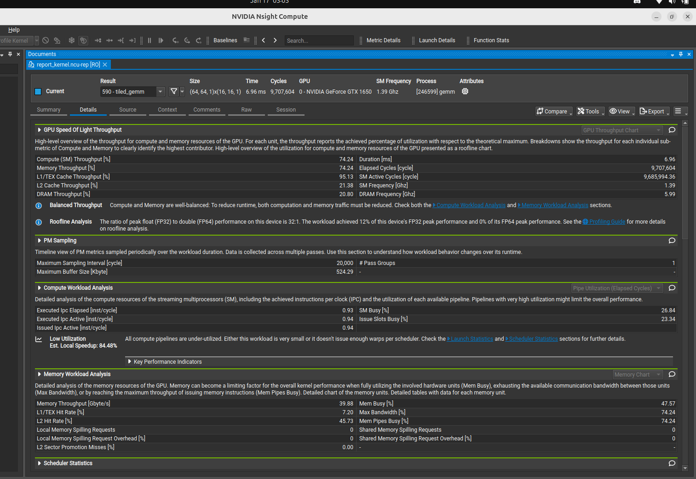

# Tiled GEMM Optimization (Shared Memory)

This folder contains an improved Matrix Multiplication implementation using **Shared Memory Tiling**. This optimization aims to reduce Global Memory accesses by caching blocks (tiles) of the input matrices into fast on-chip memory.

## 1. The Implementation (`gemm.cu`)
The kernel `tiled_gemm` uses a tiling strategy:
*   **Shared Memory**: We allocate `__shared__ float tileA[BLOCK_SIZE][BLOCK_SIZE]` and `tileB`.
*   **Cooperative Loading**: Each thread block loads a tile of `A` and `B` from global memory into shared memory.
*   **Synchronization**: `__syncthreads()` ensures all data is loaded before computation.
*   **Compute**: The inner loop computes the dot product using the fast shared memory data.

```cpp
// Key Tiling Loop
for (int t = 0; t < (K + BLOCK_SIZE - 1) / BLOCK_SIZE; ++t) {
    // 1. Collaborative Load to Shared Mem
    tileA[ty][tx] = A[...]; 
    tileB[ty][tx] = B[...];
    __syncthreads();

    // 2. Compute using Shared Mem (Fast)
    for (int i = 0; i < BLOCK_SIZE; ++i) 
        sum += tileA[ty][i] * tileB[i][tx];
    __syncthreads();
}
```

## 2. Profiling & Performance Analysis
We profiled this kernel using **Nsight Compute** on a **GTX 1650 (Turing Architecture)**. The results show significant improvements over the naive version, but also reveal new bottlenecks.

### Kernel Overview
*   **Duration**: **6.96 ms** (Massive improvement from naive version).
*   **Throughput**: ~74 GFLOPS (Effective).
*   **Occupancy**: Limited by registers (38 regs/thread).



### What the Profiling Tells Us

#### A. The Good: Reduced Global Memory Pressure
By reusing data from shared memory (16x reuse factor since `BLOCK_SIZE=16`), we drastically reduced global memory bandwidth demand. The execution time dropped significantly because we are no longer stalling 99% of the time on DRAM.

#### B. The Bad: Shared Memory Bank Conflicts & MIO Throttling
While we solved the Global Memory bottleneck, we hit a new one: **Shared Memory Latency**.

Referencing the **Source View** (`ncu_source.png`):


1.  **Stalls on Inner Loop (Line 39)**: 
    *   **51% of Stalls** happen on `sum += tileA[...] * tileB[...]`.
    *   **Reason**: The "MIO Throttle" metric is high (16.7 cycles). This indicates the math instruction pipeline is waiting on the **Memory Input/Output** unit.
    *   **Root Cause**: **Bank Conflicts**. `tileB` is accessed column-wise (`tileB[i][tx]`). In shared memory, 32-bit words are stored in 32 banks. Accessing the same bank by multiple threads in a warp causes serialization.

2.  **Stalls on Loads (Line 23 & 30)**:
    *   **Line 23 (Load A)**: 66% Stalls. `A` is row-major, so loading `A` is coalesced (good), but global memory latency still causes stalls.
    *   **Line 30 (Load B)**: 14% Stalls. `B` is row-major but we access it somewhat strided for the tile, leading to less efficient memory transactions.



### Summary of Bottlenecks
*   **MIO Throttle**: Threads are waiting for data from Shared Memory.
*   **Bank Conflicts**: The access pattern for `tileB` forces serial access.
*   **Instruction Issue**: Only **0.23** instructions issued per cycle (Low), meaning the scheduler is mostly waiting on dependencies.

## 3. Future Improvements
To push performance further (targeting >100 GFLOPS), we need to address the Shared Memory conflicts:

1.  **Padding for Bank Conflicts**:
    *   Declare shared memory as `__shared__ float tile[BLOCK_SIZE][BLOCK_SIZE + 1];`
    *   This extra "padding" shifts the memory addresses so that column-wise accesses land in different banks, allowing parallel access.
2.  **Vectorized Loads**:
    *   Use `float4` types to load 4 floats in a single instruction, improving bandwidth utilization.
3.  **Double Buffering**:
    *   Load the *next* tile while computing the *current* tile (prefetching) to hide memory latency.